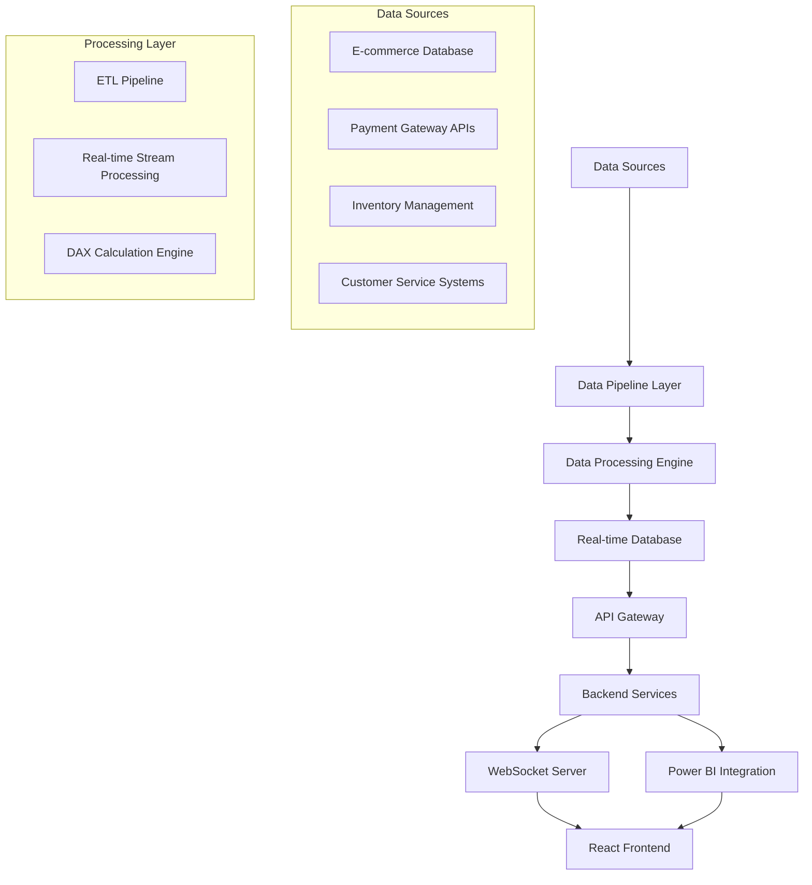

# Design Document

## Overview

The E-commerce Business Intelligence Dashboard is a real-time analytics platform built using modern web technologies with Power BI integration. The system consists of a React-based frontend, Node.js backend with Express, real-time data processing pipelines, and integration with Power BI for advanced analytics and DAX calculations. The architecture supports live data streaming, complex business logic, and interactive visualizations.

## Architecture

### High-Level Architecture



### Technology Stack

**Frontend:**
- React 18 with TypeScript
- Power BI Embedded SDK
- Chart.js for custom visualizations
- Socket.io-client for real-time updates
- Material-UI for component library

**Backend:**
- Node.js with Express.js
- Socket.io for WebSocket connections
- Redis for caching and session management
- JWT for authentication

**Data Layer:**
- PostgreSQL for transactional data
- InfluxDB for time-series metrics
- Apache Kafka for event streaming
- Power BI Service for advanced analytics

**Infrastructure:**
- Docker containers
- NGINX reverse proxy
- PM2 for process management

## Components and Interfaces

### 1. Data Pipeline Service

**Purpose:** Handles data ingestion, transformation, and real-time processing

**Key Components:**
- `DataConnector`: Manages connections to various data sources
- `StreamProcessor`: Processes real-time data streams using Kafka
- `ETLEngine`: Performs batch data transformations
- `DataValidator`: Ensures data quality and integrity

**Interfaces:**
```typescript
interface DataPipeline {
  ingestData(source: DataSource, config: IngestionConfig): Promise<void>;
  processStream(streamName: string, processor: StreamProcessor): void;
  validateData(data: any[], rules: ValidationRule[]): ValidationResult;
}
```

### 2. Analytics Engine

**Purpose:** Executes DAX calculations and generates business metrics

**Key Components:**
- `DAXCalculator`: Executes complex DAX measures
- `MetricsAggregator`: Aggregates KPIs across different dimensions
- `TrendAnalyzer`: Identifies patterns and trends in data
- `AlertEngine`: Monitors thresholds and generates alerts

**Interfaces:**
```typescript
interface AnalyticsEngine {
  calculateDAXMeasure(measure: DAXMeasure, context: AnalysisContext): Promise<number>;
  aggregateMetrics(metrics: Metric[], groupBy: string[]): Promise<AggregatedResult>;
  detectTrends(data: TimeSeriesData, algorithm: TrendAlgorithm): TrendAnalysis;
}
```

### 3. Dashboard Service

**Purpose:** Manages dashboard configurations and user interactions

**Key Components:**
- `DashboardManager`: Handles dashboard CRUD operations
- `VisualizationEngine`: Renders charts and graphs
- `FilterManager`: Manages dashboard filters and interactions
- `ExportService`: Handles data export functionality

**Interfaces:**
```typescript
interface DashboardService {
  createDashboard(config: DashboardConfig): Promise<Dashboard>;
  updateVisualization(dashboardId: string, vizId: string, config: VizConfig): Promise<void>;
  applyFilters(dashboardId: string, filters: Filter[]): Promise<FilteredData>;
}
```

### 4. Real-time Communication Service

**Purpose:** Manages WebSocket connections and real-time updates

**Key Components:**
- `WebSocketManager`: Handles client connections
- `EventBroadcaster`: Broadcasts updates to connected clients
- `SubscriptionManager`: Manages client subscriptions to data streams

**Interfaces:**
```typescript
interface RealtimeService {
  broadcastUpdate(channel: string, data: any): void;
  subscribeToUpdates(clientId: string, channels: string[]): void;
  unsubscribe(clientId: string, channels: string[]): void;
}
```

## Data Models

### Core Business Entities

```typescript
interface SalesMetric {
  id: string;
  timestamp: Date;
  revenue: number;
  orderCount: number;
  averageOrderValue: number;
  conversionRate: number;
  period: TimePeriod;
}

interface CustomerBehavior {
  customerId: string;
  sessionId: string;
  pageViews: number;
  timeOnSite: number;
  purchaseIntent: number;
  segmentId: string;
  lifetimeValue: number;
}

interface SupplyChainKPI {
  productId: string;
  currentStock: number;
  reorderPoint: number;
  leadTime: number;
  supplierPerformance: number;
  fulfillmentRate: number;
  lastUpdated: Date;
}

interface Dashboard {
  id: string;
  name: string;
  userId: string;
  layout: DashboardLayout;
  visualizations: Visualization[];
  filters: Filter[];
  refreshInterval: number;
  permissions: Permission[];
}
```

### Power BI Integration Models

```typescript
interface PowerBIReport {
  reportId: string;
  workspaceId: string;
  embedUrl: string;
  accessToken: string;
  datasetId: string;
  refreshSchedule: RefreshSchedule;
}

interface DAXMeasure {
  name: string;
  expression: string;
  table: string;
  formatString: string;
  description: string;
}
```

## Error Handling

### Error Categories

1. **Data Pipeline Errors**
   - Connection failures to data sources
   - Data transformation errors
   - Schema validation failures

2. **Real-time Processing Errors**
   - WebSocket connection drops
   - Message queue failures
   - Stream processing errors

3. **Power BI Integration Errors**
   - Authentication failures
   - Report embedding errors
   - DAX calculation errors

### Error Handling Strategy

```typescript
class ErrorHandler {
  handleDataPipelineError(error: DataPipelineError): void {
    // Log error details
    // Implement retry logic with exponential backoff
    // Send alerts to administrators
    // Fallback to cached data if available
  }

  handleRealtimeError(error: RealtimeError): void {
    // Attempt reconnection
    // Queue messages for retry
    // Notify affected clients
  }

  handlePowerBIError(error: PowerBIError): void {
    // Refresh authentication tokens
    // Retry report loading
    // Display fallback visualizations
  }
}
```

## Testing Strategy

### Unit Testing
- Test individual components and services
- Mock external dependencies (databases, APIs)
- Achieve 90%+ code coverage
- Use Jest for JavaScript/TypeScript testing

### Integration Testing
- Test data pipeline end-to-end flows
- Verify Power BI integration functionality
- Test real-time communication between services
- Use Docker containers for consistent test environments

### Performance Testing
- Load testing for concurrent users
- Stress testing for high-volume data processing
- Real-time latency testing for WebSocket communications
- Database query performance optimization

### End-to-End Testing
- Automated browser testing with Playwright
- Test complete user workflows
- Verify dashboard interactivity and responsiveness
- Test across different browsers and devices

### Data Quality Testing
- Validate data accuracy and completeness
- Test DAX calculation correctness
- Verify real-time data synchronization
- Monitor data pipeline health and performance

## Security Considerations

### Authentication & Authorization
- JWT-based authentication
- Role-based access control (RBAC)
- Power BI row-level security integration
- Session management with Redis

### Data Protection
- Encryption at rest and in transit
- Secure API endpoints with rate limiting
- Input validation and sanitization
- Audit logging for sensitive operations

### Infrastructure Security
- Container security scanning
- Network segmentation
- Regular security updates
- Monitoring and alerting for security events